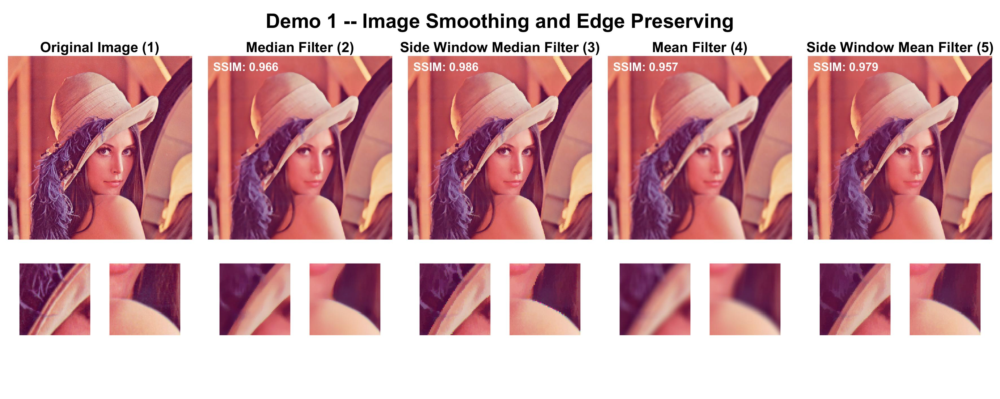
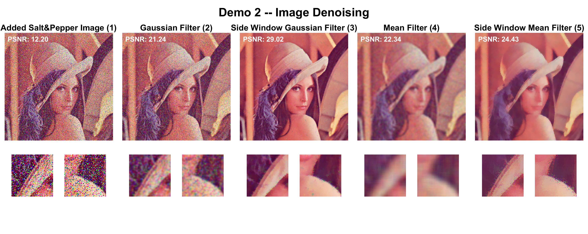
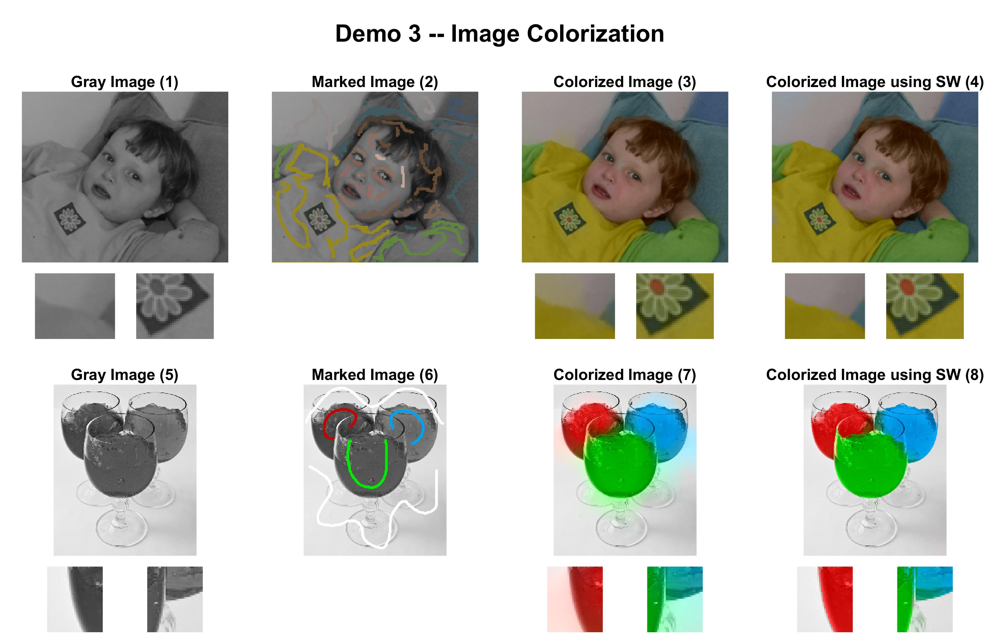

# Side Window Filtering

******



Introduction: "Side Window Filtering" from CVPR 2019 paper. MATLAB implementation with some applications. Filters (mean, median, gaussian) and applications (smoothing, denoising, coloring) are implemented.  

Author: [Shallwe](https://github.com/shallwe999)  
Paper: [Side Window Filtering](https://arxiv.org/abs/1905.07177)  
Cite codes: [SideWindowFilter](https://github.com/YuanhaoGong/SideWindowFilter), [Colorization](https://www.cs.huji.ac.il/~yweiss/Colorization/)  

******

## Environment

Run in MATLAB. Tested in `MATLAB 2019b` .  

## How to run

You can run the following files.  

- `demo1.m` : Demo 1 -- Image Smoothing and Edge Preserving
- `demo2.m` : Demo 2 -- Image Denoising
- `demo3.m` : Demo 3 -- Image Colorization

Result images will be saved after processing.  

## Results

Demo 1 -- Image Smoothing and Edge Preserving  


Demo 2 -- Image Denoising  



Demo 3 -- Image Colorization  



## Todo

- In demo 1, speed of SW-MED is too slow. It should be accelerated.

- In demo 3, why does max operator work and min operator not work? I think it's wrong. If you know why, you can give me suggestions.

- In demo 3 code `csig = c_var*2;` , if set 0.6, original algorithm has a good performance. What does it affect?

## Credits

If found useful, please give me a **star**:star2:! :)

And you can cite the author of the paper.

- GitHub Website: [SideWindowFilter](https://github.com/YuanhaoGong/SideWindowFilter)

- This paper: [Side Window Filtering](https://arxiv.org/abs/1905.07177)

```text
@inproceedings{swfilter, 
    author={Hui Yin and Yuanhao Gong and Guoping Qiu}, 
    Booktitle = {CVPR}, 
    title={Side Window Filtering}, 
    year={2019}, }
```

